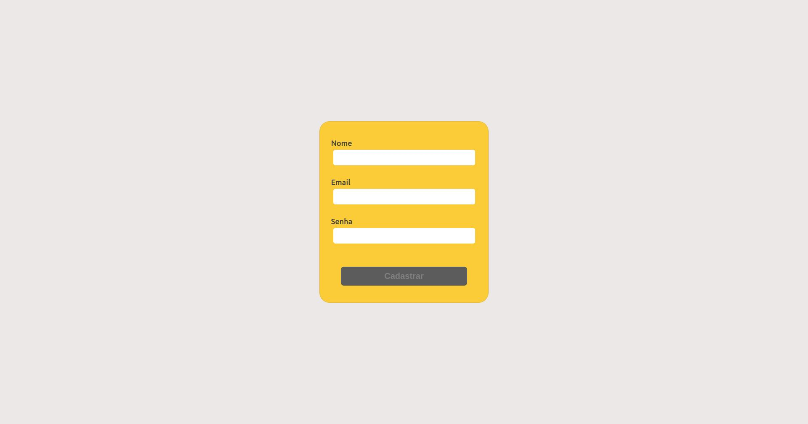

# Delivery App

Uma aplicação que simula um site de compra de bebidas, o usuário pode se cadastrar, escolher as bebidas da tela de produtos, escolher seu endereço na tela de checkout, checar suas ordens na tela de ordens, marcar seu pedido caso seja entregue.
Como vendedor pode checar suas ordens, marcar o pedido como "preparando" e como "saiu para entrega".
Como administrador, pode cadastrar ou deletar usuários.

## Indice
* [Deploy](#deploy)
* [Tecnologias](#tecnologias)
* [Observações](#observações)
* [Instalação](#instalação)
* [Configuração](#configuração)
* [Iniciando](#iniciando)
* [Funcionalidades](#funcionalidades)
* [Rotas](#rotas)
* [FeedBack](#feedback)

## Screenshots





## Deploy
Deploy ainda sendo inplementado.(#deploy)

## Tecnologias
<ul id='tecnologias'>
  <li><a href="https://reactjs.org">React</a></li>
  <li><a href="https://www.mysql.com/">MySQL</a></li>
  <li><a href="https://nodejs.org/en/">Node.js</a></li>
  <li><a href="https://sass-lang.com/">Sass</a></li>
</ul>

## Observações

<ul>
  <li>A parte de marcar o pedido como entregue, como vendedor preparando ou saiu para entrega, não foi implementada.</li>
  <li>Projeto feito com eslint da Trybe.</li>
</ul>

## Instalação
Assim que tiver clonado o repositório, usando o terminal do [vscode](https://code.visualstudio.com/) ou o terminal do seu sistema operacional.
- Installe as dependencias usando :
```
npm install
```
Faça o comando tanto na pasta raiz, quanto nas pastas **back-end** e **front-end**.

## Configuração
#### Criando o Database
- Para criar e popular o database, pode usar o seguinte comando dentro da pasta **back-end**:
```
"npm run db:reset"
```

## Iniciando
#### Iniciando a aplicação
Na ordem:
- Na pasta back-end, abra o terminal e digite ```npm run dev``` em seu terminal, para iniciar a servidor na porta 3001.

- Na pasta front-end, abra o terminal e digite ```npm start``` em seu terminal, para iniciar a servidor na porta 3000.

## Funcionalidades

### Front-End
<ul>
  <li>Login
    <ul>
      <li>Caso encontre as informações no back-end, o usuário é direcionado a tela de produtos.</li>
      <li>Pode clicar no botão "Ainda não tenho conta", para ir para tela de registros.</li>
      <li>Caso haja algum erro pelo back-end, o erro é exibido abaixo do input senha.</li>
      O botão de login será desabilitado se:
      <ul>
        <li>Email não estiver no formato de email.</li>
        <li>Senha maior for menor que 6 caracteres.</li>
      </ul>
      <li>Faz um crivo no front-end de acordo com o padrão de email e tamanho de senha maior que 5,</li>
    </ul><br>
  </li>
  
   <li>Register
    <ul>
      <li>Faz registro de usuários novos, se a criação for bem sucedida, será direcionado para a tela de produtos.</li>
      <li>Caso haja algum erro pelo back-end, o erro é exibido abaixo do input senha.</li>
      O botão cadastro será desabilitado se:
      <ul>
        <li>O nome for menor que 12 caracteres.</li>
        <li>Email não estiver no formato de email.</li>
        <li>Senha maior for menor que 6</li>
      </ul>
    </ul><br>
  </li>
  
  <li>Produtos
    <ul>
      <li>Mostra todas as bebidas disponíveis</li>  
      <li>Podem ser selecionados um por um, ou adicionados em quantidades específicas pelo input do card.</li> 
      <li>São recomendados comidas ser o usuário está na tela de bebidas, vice-versa.</li>
      <li>Esta tela tem um header espefícico, onde se encontram quatro botões.</li>
      <ul>
        <li>Produtos: te direciona para a tela de produtos.</li>
        <li>Meus Pedidos: te direciona para a tela de pedidos.</li>
        <li>Nome do usuário: te direciona para a tela de produtos.</li>
        <li>Sair: Te direciona para a tela de Login e limpa o localStorage.</li>
      <li>Caso clique no Botão "Ver Carrinho", será direcionado a tela de Checkout.</li>
      </ul>
    </ul><br>

  </li>
    <li>Checkout
    <ul>
      <li>Mostra todo o seu carrinho de compras.</li>
      <li>Esta tela só é acessivel pelo usuário e mostra o header do usuário.</li>
      <li>Você pode remover os itens do carrinho,escolher o vendedor, e o  endereço de entrega.</li>  
      <li>Após clicar em finalizar pedido, o usuário será direcionado para a Tela de UserOrders</li>  
    </ul><br>
  </li>
  
  <li>User Orders
    <ul>
      <li>Tela onde mostram as ordens ligadas ao usuário.</li>
      <li>Esta tela só é acessivel pelo usuário e mostra o header do usuário.</li>
      <li>Caso clique em uma ordem, será direcionado para a tela de detalhe da ordem.</li>
    </ul><br>
  </li>
  
  <li>User Order Details
    <ul>
      <li>Tela onde mostra o detalhe da ordem onde foi clicada.</li>
      <li>Esta tela só é acessivel pelo usuário e mostra o header do usuário.</li>
      <li>Nesta tela, caso esteja como Status Pendente, pode-se clicar no botão Marcar como Entregue.</li>
    </ul><br>
  </li>
  
   <li>Seller Order
    <ul>
      <li>Tela onde mostram as ordens ligadas ao vendedor.</li>
      <li>Esta tela só é acessivel pelo vendedor e mostra o header do vendedor.</li>
      <li>Caso clique em uma ordem, será direcionado para a tela de detalhe da ordem.</li>
    </ul><br>
  </li>

  <li>Seller Order Details
    <ul>
      <li>Tela onde mostra o detalhe da ordem onde foi clicada.</li>
      <li>Esta tela só é acessivel pelo vendedor e mostra o header do vendedor.</li>
      <li>Nesta tela, caso esteja como Status Pendente, todos os botões serão habilitados.</li>
      <li>Caso esteja como Status Preparando, apenas o botão "Saiu para Entrega" será habilitado.</li>
      <li>Caso esteja como Status Entregue, nenhum botão será habilitado.</li>
    </ul><br>
  </li>

  <li>Admin
    <ul>
      <li>Tela onde mostra todos os usuários que não são admins.</li>
      <li>Pode se cadastrar qualquer tipo de usuário nesta tela.</li>
      <li>Caso o email desejado esteja cadastrado, aparecerá um erro abaixo dos inputs.</li>
      <li>O admin poderá excluir qualquer usuário.</li>
      O botão cadastro será desabilitado se:
      <ul>
        <li>O nome for menor que 1 caracter.</li>
        <li>Email não estiver no formato de email.</li>
        <li>Senha maior for menor que 6</li>
      </ul>
    </ul><br>
  </li>
  

  ## Rotas
  ### Back-end
  
## Feedback 

Ficarei bem agradecido caso queira me dar um feedback costrutivo, caso queira meus contatos estarão abaixo!

Email: rods.leite27@gmail.com e <a href="https://linkedin.com/in/rodrigoleite27">Linkedin</a>.
